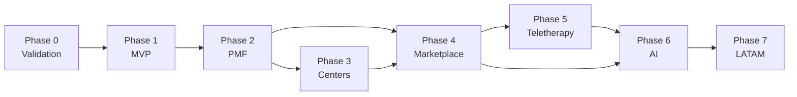

# NexusOne Roadmap

**Last updated:** 2026-06-07

Each phase has a **gate** — criteria that must be met before the next phase begins. Detailed docs in [docs/](docs/README.md).

---

## Phase 0 — Validation ← Current

**Duration:** 2–4 weeks  
**Doc:** [Phase 0 Plan](docs/validation/phase-0-plan.md)

### Goals

- Interview 20 independent psychologists
- Interview 5 therapy center admins (signal only)
- Validate pricing (RD$700–1,200/month)
- Confirm MVP feature priorities via workflow interviews

### Deliverables

- Customer interview notes
- Updated [hypothesis log](docs/validation/hypothesis-log.md)
- Confirmed MVP scope
- 3 pilot customer commitments

### Success Criteria (Gate to Phase 1)

| Criterion | Target |
|-----------|--------|
| Psychologists expressing interest | ≥ 10 |
| Pilot commitments | ≥ 3 |
| Pricing validated | Majority accept RD$700–1,200/month |
| WhatsApp as reminder channel | Confirmed by majority |

---

## Phase 1 — MVP

**Duration:** 8 weeks  
**Depends on:** Phase 0 gate passed  
**Doc:** [MVP Scope](docs/product/mvp-scope.md)

### Goal

Launch first paying version for solo psychologists.

### Features

| Area | Scope |
|------|-------|
| Auth | Login, registration (email + Google) |
| Patients | CRUD, search, archive |
| Scheduling | Calendar, recurring, reschedule, cancel |
| Notes | Session notes, patient history, encryption |
| Payments | Track payments, revenue dashboard |
| WhatsApp | Appointment reminders (24h, 2h) |

### Success Metrics

- 10 paying psychologists
- MRR > $100 USD

---

## Phase 2 — Product-Market Fit

**Duration:** 3 months  
**Depends on:** Phase 1 launched with paying customers

### Features

- **Smart Waitlist** — automatic slot recovery (killer feature)
- Advanced reporting — revenue, attendance, no-shows
- Multi-user accounts — assistant access
- Mobile UX improvements

### Success Metrics

- 50 customers
- MRR > $1,000

---

## Phase 3 — Therapy Centers

**Duration:** 3 months  
**Depends on:** Phase 2 PMF signals  
**Doc:** [Center Workflows (future)](docs/future/therapy-center-workflows.md)

### Features

- Organizations — multiple therapists per center
- Room management
- Admin dashboard — center analytics
- Therapist productivity reports

### Success Metrics

- 10 centers onboarded
- MRR > $3,000

---

## Phase 4 — Marketplace

**Duration:** 6 months  
**Depends on:** Sufficient therapist supply from Phases 1–3

### Goal

Acquire patients for therapists.

### Features

- Public therapist profiles
- Search by specialty
- Direct online booking
- Patient reviews

### Revenue

Commission per booking

### Success Metrics

- 500 monthly bookings
- MRR > $8,000

---

## Phase 5 — Teletherapy

**Duration:** 4 months  
**Depends on:** Stable marketplace or strong therapist base

### Features

- Video sessions (built-in telehealth)
- Secure patient chat
- File sharing (documents, exercises)

### Success Metrics

- 20% of sessions conducted online

---

## Phase 6 — AI Layer

**Duration:** Ongoing  
**Depends on:** Sufficient note volume and user trust

### Features

- AI session summaries
- Practice insights and recommendations
- Scheduling optimization
- Patient management assistant

### Success Metrics

- 30% feature adoption
- Premium upsell conversion > 10%

---

## Phase 7 — Latin America Expansion

**Countries:** Dominican Republic → Colombia → Mexico → Chile

### Features

- Localization (language, formats)
- Multi-currency billing
- Regional compliance (data protection)

### Goal

Leading mental health operating system for Spanish-speaking therapists.

### Target

- 500+ therapists
- 50+ centers
- $20k–$50k MRR

---

## Phase Dependencies

---

## Business Model by Phase

| Phase | Revenue model |
|-------|---------------|
| 1–3 | SaaS subscription (individual + center plans) |
| 4+ | SaaS + marketplace commission |
| 6+ | SaaS + commission + AI premium tier |
