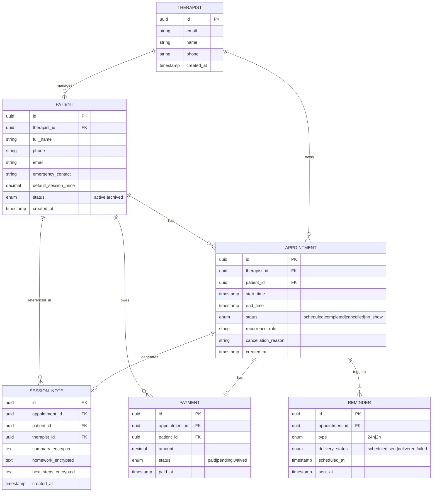

# Data Model Sketch

**Status:** Draft — validate entity boundaries during Phase 0 interviews  
**Not a schema** — conceptual map for alignment before Drizzle migrations

## Entity Relationship Diagram

## Entity Summary

| Entity | Purpose | MVP? |
|--------|---------|------|
| Therapist | Account owner; all data scoped to therapist | Yes |
| Patient | Person receiving treatment | Yes |
| Appointment | Scheduled session with status lifecycle | Yes |
| SessionNote | Clinical documentation linked to appointment | Yes |
| Payment | Financial record per session | Yes |
| Reminder | WhatsApp reminder with delivery tracking | Yes |
| WaitlistEntry | Patient waiting for open slot | Phase 2 |
| Organization | Therapy center grouping therapists | Phase 3 |
| Room | Physical room at a center | Phase 3 |

## Key Relationships

- **Single-tenant MVP:** Every record belongs to one `Therapist`. No org/team model yet.
- **Appointment is the hub:** Notes, payments, and reminders attach to appointments.
- **Patient is the longitudinal view:** Aggregates appointments, notes, and payments for history.
- **Archive = soft status:** Patient `status: archived` hides from active list; records retained.

## Status Enums

### Appointment
`scheduled` → `completed` | `cancelled` | `no_show`

### Payment
`pending` → `paid` | `waived`

### Reminder
`scheduled` → `sent` → `delivered` | `failed`

## Open Questions

- [ ] One note per appointment, or allow multiple (addendum)?
- [ ] Payment per appointment vs bulk monthly payment covering multiple sessions?
- [ ] Recurrence: store as RRULE string or separate recurrence table?
- [ ] No-show: distinct from cancelled, or sub-type of cancelled?
- [ ] Timezone handling — all Santo Domingo (AST, UTC-4) for MVP?

## Validation Prompts

Ask in interviews:

1. Do you think of payments per session or per month?
2. Would you ever write more than one note per session?
3. Is "no-show" different from "cancelled" in how you track it?

Update this sketch based on answers before writing Drizzle schema.
