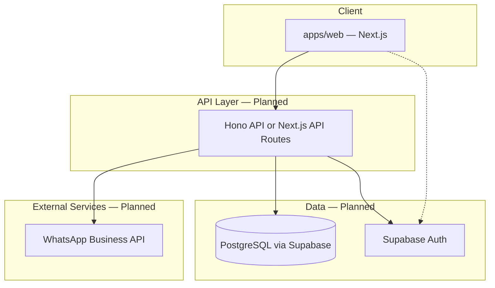

# Architecture Overview

## System Context

NexusOne is a monorepo SaaS application. The web app is the primary interface for psychologists. A backend API handles business logic, persistence, and WhatsApp integration.



## Monorepo Structure

```
nexus-one/
├── apps/
│   └── web/              # Next.js 16 app (built)
├── packages/
│   ├── ui/               # Shared shadcn/ui components (built)
│   ├── eslint-config/    # Shared ESLint config (built)
│   └── typescript-config/ # Shared TS config (built)
├── docs/                 # Product & technical documentation (built)
├── PRD.md
├── ROADMAP.md
└── README.md
```

## Built vs Planned

| Component | Status | Notes |
|-----------|--------|-------|
| `apps/web` (Next.js 16) | **Built** | Scaffold with shared UI |
| `packages/ui` (shadcn) | **Built** | Button, theme provider |
| Turbo + pnpm monorepo | **Built** | Workspace tooling |
| Authentication | Planned | Supabase Auth (email + Google) |
| API layer | Planned | Hono or Next.js API routes — [open decision](tech-stack.md) |
| PostgreSQL + Drizzle | Planned | Via Supabase |
| WhatsApp reminders | Planned | WhatsApp Business API |
| Feature modules | Planned | patients, scheduling, notes, payments, reminders |

## Domain Boundaries (Planned)

Each domain maps to a future feature module in `apps/web` (or API routes):

| Domain | Responsibility |
|--------|----------------|
| Patients | Profiles, search, archive |
| Scheduling | Calendar, recurrence, cancel/reschedule |
| Notes | Session documentation, encryption, search |
| Payments | Status tracking, revenue aggregation |
| Reminders | WhatsApp scheduling, templates, delivery status |
| Auth | Therapist accounts, sessions |

## Deployment (Planned)

| Layer | Target |
|-------|--------|
| Frontend | Vercel |
| Database + Auth | Supabase |
| API | Vercel (if Next.js routes) or separate service (if Hono) |
| WhatsApp | Meta Business API via webhook handler |

See [Tech Stack](tech-stack.md) for technology choices.
