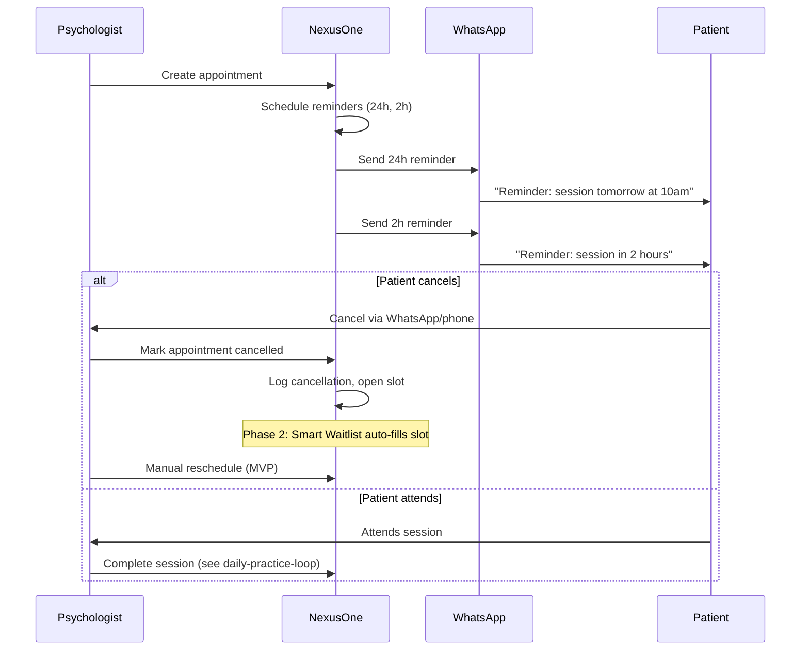

# Workflow: Cancellation & Waitlist

**Persona:** Solo psychologist (Dr. Ana)  
**Phase:** MVP reminders + cancellation logging; Smart Waitlist in Phase 2

## Purpose

Reduce no-shows with automatic WhatsApp reminders, handle cancellations cleanly, and (in Phase 2) recover empty slots via Smart Waitlist.

## Actors

| Actor | Role |
|-------|------|
| Psychologist | Configures reminders, handles cancellations, manages waitlist (Phase 2) |
| Patient | Receives reminders; cancels via WhatsApp or phone |
| NexusOne | Schedules and tracks reminders; logs cancellations |
| WhatsApp Business API | Delivers reminder messages |

## Trigger

Appointment is created or is approaching; or patient cancels an existing appointment.

## Steps

### Reminder Flow (MVP)

1. Psychologist creates appointment (or recurring series)
2. System schedules WhatsApp reminders: 24 hours before and 2 hours before
3. At scheduled time, system sends templated message via WhatsApp
4. System records delivery status (sent / delivered / failed)
5. Patient attends or contacts psychologist to cancel

### Cancellation Flow (MVP)

6. Patient cancels (WhatsApp message, phone call, or in-person)
7. Psychologist marks appointment as cancelled in NexusOne
8. Slot appears as open on calendar
9. Psychologist manually reschedules or contacts another patient

### Smart Waitlist (Phase 2 — not MVP)

10. System detects open slot from cancellation
11. System queries waitlist for matching availability
12. System sends WhatsApp to first waitlisted patient: "Slot available — accept?"
13. First patient to accept gets the appointment
14. System updates calendar and notifies psychologist

## Flow Diagram

## Current State (Without NexusOne)

| Step | Today |
|------|-------|
| Reminders | Manual WhatsApp messages; often forgotten for some patients |
| Cancellation | Patient texts; psychologist manually updates calendar |
| Slot recovery | Psychologist mentally scans who might want the slot |
| Waitlist | Informal — names in notes or memory |

## NexusOne MVP (Phase 1)

- Automatic WhatsApp reminders at 24h and 2h
- Configurable message templates (patient name, date, time)
- Delivery status tracking per reminder
- Cancellation status on appointments with reason (optional)
- Open slots visible on calendar

## Future — Smart Waitlist (Phase 2)

- Patients opt into waitlist with preferred times
- Auto-notification when matching slot opens
- First-accept wins (WhatsApp reply or link)
- Metric: recovered appointments per month

## Validation Questions

1. How often do patients cancel or no-show per month?
2. Do you send reminders today? How consistently?
3. Do you keep a mental or written waitlist?
4. If a slot opened tomorrow at 10am, how would you fill it today?
5. Would automatic waitlist outreach via WhatsApp feel helpful or intrusive?
6. What reminder timing works best — 24h, 2h, both, other?

## Open Questions

- [ ] WhatsApp Business API provider and cost per message in DR
- [ ] Two-way WhatsApp (patient replies "cancel") — MVP or Phase 2?
- [ ] Waitlist priority: first-in-first-out vs best time match?
- [ ] Should no-show (no cancellation, no attendance) be a separate status?
- [ ] Reminder language/tone — formal vs friendly template defaults
