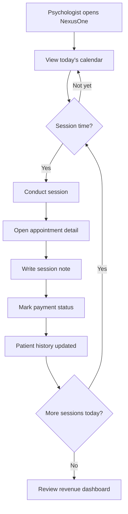

# Workflow: Daily Practice Loop

**Persona:** Solo psychologist (Dr. Ana)  
**Phase:** MVP (Phase 1)

## Purpose

Support the psychologist's core daily rhythm: review today's schedule, conduct sessions, document notes, and track payments — without switching between WhatsApp, Calendar, Excel, and paper.

## Actors

| Actor | Role |
|-------|------|
| Psychologist | Reviews schedule, conducts sessions, writes notes, updates payments |
| Patient | Attends session (passive in this workflow) |
| NexusOne | Displays calendar, stores notes and payment status |
| WhatsApp (system) | Sends reminders (see [Cancellation & Waitlist](cancellation-waitlist.md)) |

## Trigger

Psychologist starts their workday or opens NexusOne before/after a session.

## Steps

1. Psychologist logs in and opens the calendar (day view)
2. System shows today's appointments with patient name, time, and payment status
3. Psychologist conducts the session (off-platform)
4. After session, psychologist opens the appointment and creates a session note
5. Psychologist enters summary, homework, and next steps
6. Psychologist marks payment status (paid / pending)
7. System updates patient session history and revenue totals
8. Psychologist repeats for each session of the day

## Flow Diagram

## Current State (Without NexusOne)

| Step | Today |
|------|-------|
| Review schedule | Google Calendar or memory |
| Session notes | Paper, Word, or notes app — not linked to calendar |
| Payment tracking | Excel or mental notes; often delayed |
| End of day | Manual tally of who paid |

## NexusOne MVP (Phase 1)

- Calendar day/week view with patient-linked appointments
- One-click note creation from appointment detail
- Payment toggle on appointment (paid / pending / waived)
- Patient profile shows full session history
- Monthly revenue dashboard auto-calculated

## Future (Phase 2+)

- AI-generated session summary drafts from therapist bullet points
- Payment reconciliation with bank transfers or card processing
- End-of-day summary notification ("3 sessions, 1 pending payment")
- Voice-to-text note capture

## Validation Questions

Use these in [interviews](../validation/interview-guide.md):

1. Walk me through yesterday — how did you track sessions, notes, and payments?
2. When do you write session notes — during session, right after, or end of day?
3. How do you know who hasn't paid this month?
4. Would a single calendar + notes + payments view change your routine?
5. What's missing from this flow that would stop you from using it daily?

## Open Questions

- [ ] Default session duration and price — per therapist or per patient?
- [ ] Can notes be created without a linked appointment (ad-hoc)?
- [ ] Should unpaid sessions trigger a reminder to the psychologist?
