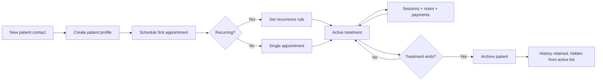

# Workflow: Patient Lifecycle

**Persona:** Solo psychologist (Dr. Ana)  
**Phase:** MVP (Phase 1)

## Purpose

Manage a patient from first contact through active treatment to archive — with a single profile that holds contact info, appointment history, notes, and payment record.

## Actors

| Actor | Role |
|-------|------|
| Psychologist | Creates profile, schedules sessions, reviews history, archives |
| Patient | Provides contact info (in person or via WhatsApp) |
| NexusOne | Stores profile, links appointments/notes/payments |

## Trigger

New patient reaches out (referral, WhatsApp, walk-in) and psychologist decides to begin treatment.

## Steps

### Intake

1. Psychologist creates a new patient profile
2. Enters: full name, phone, email, emergency contact
3. Optionally sets default session price and preferred time slot
4. Schedules first appointment (single or recurring)

### Active Treatment

5. Recurring appointments appear on calendar
6. Each session generates a note and payment record (see [Daily Practice Loop](daily-practice-loop.md))
7. Psychologist searches or browses patient list to open profile
8. Profile shows: contact info, upcoming appointments, past sessions, notes, payment summary

### Archive / Discharge

9. When treatment ends, psychologist archives the patient
10. Archived patients are hidden from active list but searchable
11. History and notes remain accessible for reference

## Flow Diagram

## Current State (Without NexusOne)

| Stage | Today |
|-------|-------|
| Intake | Contact saved in phone/WhatsApp; details scattered |
| Active | Calendar events not linked to a "patient record" |
| History | Notes in separate files; hard to see full timeline |
| Archive | Contact deleted or muted in WhatsApp; records remain scattered |

## NexusOne MVP (Phase 1)

- Patient CRUD with required contact fields
- Search by name or phone
- Patient detail page: info + appointment list + note list + payment summary
- Archive/unarchive toggle
- Recurring appointment setup from patient profile

## Future (Phase 2+)

- Digital intake forms sent via WhatsApp link
- Document uploads (consent forms, assessments)
- Discharge summary template
- Patient-facing portal (view upcoming appointments)
- Referral tracking (who referred this patient)

## Validation Questions

1. What information do you collect at intake today?
2. How do you find a patient's history when they call after 6 months?
3. Do you ever need to "deactivate" a patient without deleting their records?
4. How many active patients do you typically manage?
5. Would you schedule recurring sessions at intake or one-by-one?

## Open Questions

- [ ] Required vs optional fields at intake (email may be unused in DR)
- [ ] Duplicate detection (same phone number, different spelling)
- [ ] Can archived patients be reactivated into active treatment?
- [ ] GDPR/local data retention requirements for archived records
